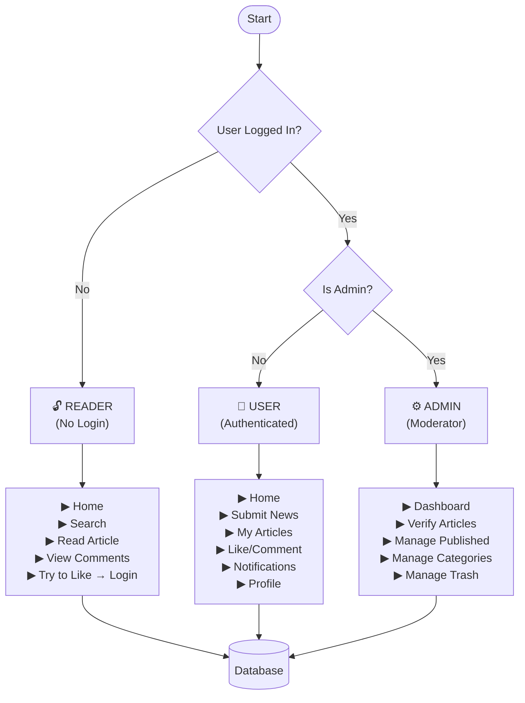
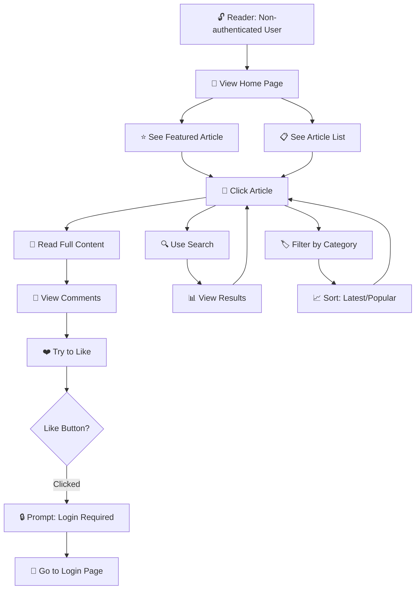
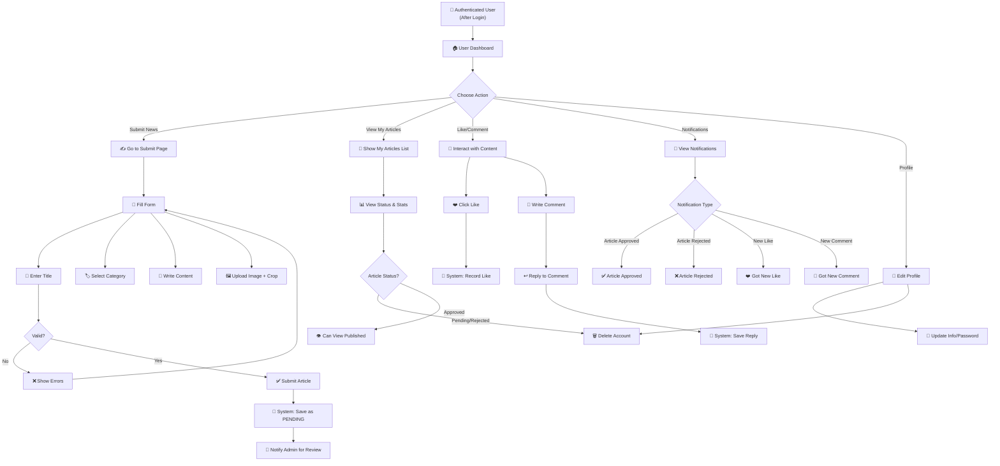
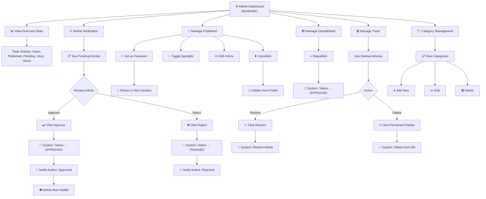
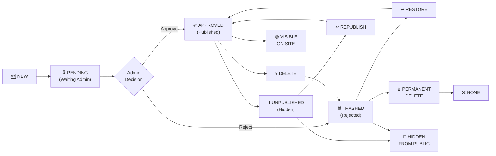
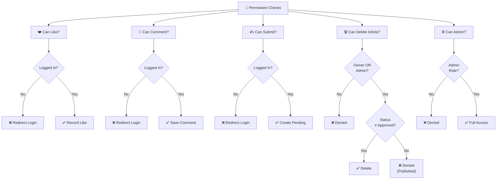
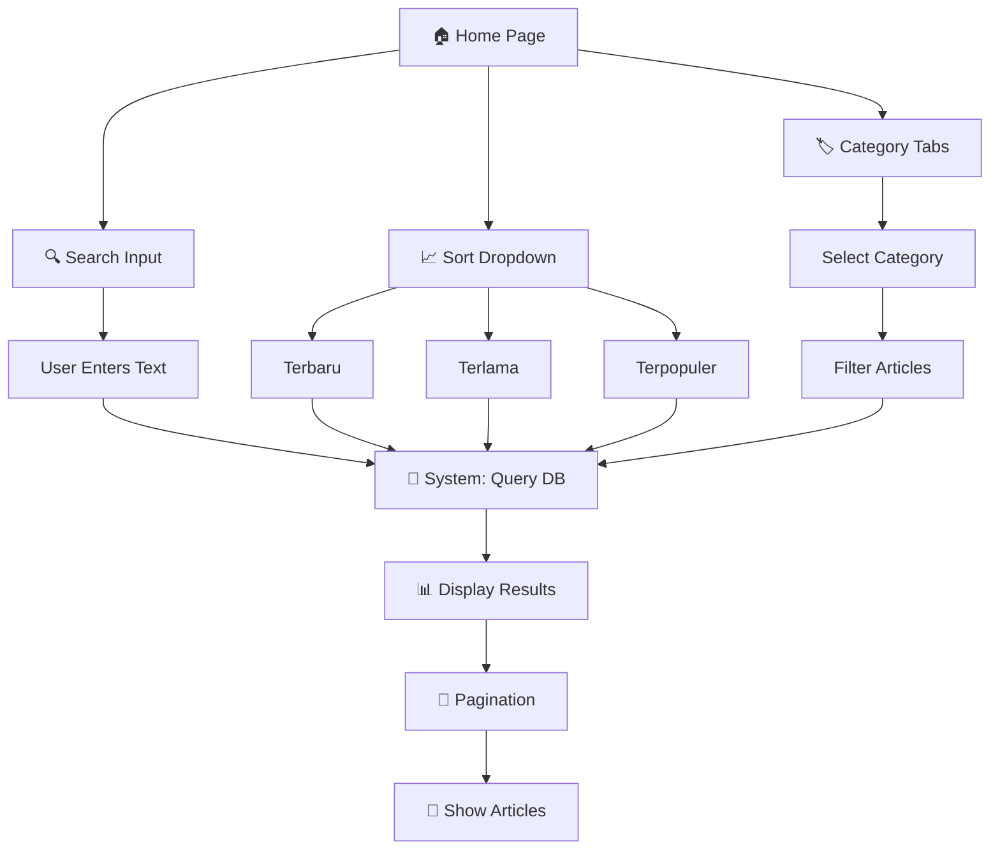

# Nusantara Daily News - Visual Flowchart (Mermaid Format)

Paste these diagrams into [Mermaid Live Editor](https://mermaid.live/) for visualization.

---

## 1. Main System Overview (All Swimlanes)



---

## 2. Reader Flow (No Login)



---

## 3. Authenticated User Flow



---

## 4. Admin Flow



---

## 5. Article Status Lifecycle



---

## 6. System Database Transactions

```mermaid
graph TD
    SYS["⚙️ SYSTEM OPERATIONS"]
    
    SYS --> AUTH["🔐 Authentication"]
    AUTH --> REG["Register: Hash password"]
    AUTH --> LOG["Login: Validate creds"]
    AUTH --> EMAIL["Email: Verify"]
    
    SYS --> ART["📄 Article Management"]
    ART --> CRT["Create: Set status PENDING"]
    ART --> UPD["Update: Modify content"]
    ART --> STS["Status: Change lifecycle"]
    ART --> VIEW["Views: Increment counter"]
    
    SYS --> INT["💬 Interactions"]
    INT --> LIKE["Like: Save ArticleLike"]
    INT --> CMT["Comment: Save + Tree"]
    INT --> REP["Reply: Link parent"]
    INT --> DEL["Delete: Remove entry"]
    
    SYS --> NOT["🔔 Notifications"]
    NOT --> NAPR["On: Article Approved"]
    NOT --> NREJ["On: Article Rejected"]
    NOT --> NLIKE["On: New Like"]
    NOT --> NCMT["On: New Comment"]
    
    SYS --> QRY["🔍 Query Operations"]
    QRY --> SRCH["Search: Title/Content"]
    QRY --> FILT["Filter: By category"]
    QRY --> SRT["Sort: Latest/Popular"]
    
    SYS --> DB[(📊 DATABASE<br/>Articles | Users | Comments<br/>Likes | Categories | Notifications)]
    
    AUTH --> DB
    ART --> DB
    INT --> DB
    NOT --> DB
    QRY --> DB
```

---

## 7. Permission Matrix



---

## 8. Search & Filter Flow


