# Nusantara Daily News - Swimlane Activity Diagram

Paste this into [Mermaid Live Editor](https://mermaid.live/) to see the swimlane diagram.

## Complete Swimlane Diagram (All 4 Actors)

```mermaid
graph TD
    subgraph READER ["🔓 READER (Non-authenticated)"]
        R1["Start"] --> R2["Access Home"]
        R2 --> R3["View Featured<br/>Article & List"]
        R3 --> R4{"Action?"}
        R4 -->|Search| R5["Enter Search Term"]
        R5 --> S1["System: Query"]
        S1 --> R6["View Results"]
        R4 -->|Filter| R7["Select Category"]
        R7 --> S2["System: Filter"]
        S2 --> R8["View Filtered List"]
        R4 -->|Sort| R9["Choose: Latest/<br/>Oldest/Popular"]
        R9 --> S3["System: Sort"]
        S3 --> R10["View Sorted List"]
        R4 -->|Read| R11["Click Article"]
        R11 --> R12["Read Full Content"]
        R12 --> R13["View Comments"]
        R13 --> R14["Try to Like"]
        R14 --> A1["🔒 Redirect to Login"]
    end
    
    subgraph USER ["👤 AUTHENTICATED USER"]
        A1 --> A2["Login Form"]
        A2 --> A3["Register or<br/>Login"]
        A3 --> S4["System: Authenticate"]
        S4 --> U1["Dashboard"]
        U1 --> U2{"Choose Action"}
        U2 -->|Submit News| U3["Go to Submit Page"]
        U3 --> U4["📝 Fill Form"]
        U4 --> U5["Enter: Title"]
        U4 --> U6["Select: Category"]
        U4 --> U7["Write: Content"]
        U4 --> U8["Upload: Image + Crop"]
        U5 --> U9{"Validate?"}
        U9 -->|Invalid| U10["❌ Show Error"]
        U10 --> U4
        U9 -->|Valid| U11["✅ Submit"]
        U11 --> S5["System: Save Article"]
        S5 --> S6["Status: PENDING"]
        S6 --> S7["Send Admin<br/>Notification"]
        
        U2 -->|View My Articles| U12["📄 My Articles"]
        U12 --> U13["Show List"]
        U13 --> U14{"Status?"}
        U14 -->|Pending| U15["Can Delete"]
        U14 -->|Rejected| U16["Can Delete"]
        U14 -->|Approved| U17["Can View<br/>Published"]
        
        U2 -->|Like/Comment| U18["💬 Open Article"]
        U18 --> U19{"Action?"}
        U19 -->|Like| U20["Click Like Button"]
        U20 --> S8["System: Record Like"]
        U19 -->|Comment| U21["Write Comment"]
        U21 --> S9["System: Save Comment"]
        U19 -->|Reply| U22["Write Reply"]
        U22 --> S10["System: Save Reply"]
        
        U2 -->|Notifications| U23["🔔 View Notifications"]
        U23 --> U24{"Type?"}
        U24 -->|Approved| U25["✅ Article Approved"]
        U24 -->|Rejected| U26["❌ Article Rejected"]
        U24 -->|Like| U27["❤️ New Like"]
        U24 -->|Comment| U28["💬 New Comment"]
        U25 --> U29["Mark as Read"]
        
        U2 -->|Profile| U30["👤 Edit Profile"]
        U30 --> U31["Update Info"]
        U31 --> S11["System: Update"]
        U30 --> U32["Change Password"]
        U32 --> S12["System: Hash"]
    end
    
    subgraph ADMIN ["⚙️ ADMIN"]
        A4["Login with<br/>Admin Role"] --> A5["System: Check Role"]
        A5 --> A6["Admin Dashboard"]
        A6 --> A7{"Choose Task"}
        
        A7 -->|Dashboard| A8["View Overview Stats"]
        A8 --> A9["📊 Total Articles"]
        A8 --> A10["Published Count"]
        A8 --> A11["Pending Count"]
        A8 --> A12["Total Users"]
        
        A7 -->|Verify| A13["Go to Pending<br/>Articles"]
        A13 --> A14["View Article"]
        A14 --> A15{"Decision?"}
        A15 -->|Approve| A16["Click Approve"]
        A16 --> S13["System: Update Status"]
        S13 --> S14["Status: APPROVED"]
        S14 --> S15["Send Notification<br/>to Author"]
        S15 --> S16["Article Visible<br/>on Home"]
        
        A15 -->|Reject| A17["Click Reject"]
        A17 --> S17["System: Update Status"]
        S17 --> S18["Status: TRASHED"]
        S18 --> S19["Send Rejection<br/>Notification"]
        
        A7 -->|Manage| A18["Published<br/>Articles"]
        A18 --> A19{"Action?"}
        A19 -->|Featured| A20["Set as Featured"]
        A20 --> S20["Article in Hero"]
        A19 -->|Spotlight| A21["Toggle Spotlight"]
        A21 --> S21["Article Highlighted"]
        A19 -->|Edit| A22["Edit Article"]
        A22 --> S22["Update Content"]
        A19 -->|Unpublish| A23["Unpublish"]
        A23 --> S23["Status: UNPUBLISHED"]
        S23 --> S24["Hidden from Public"]
        
        A7 -->|Unpublished| A24["View Unpublished"]
        A24 --> A25["Republish"]
        A25 --> S25["Status: APPROVED"]
        
        A7 -->|Trash| A26["View Trash"]
        A26 --> A27{"Action?"}
        A27 -->|Restore| A28["Restore Article"]
        A28 --> S26["Restore to<br/>Previous Status"]
        A27 -->|Delete| A29["Permanent Delete"]
        A29 --> S27["Delete from DB"]
        
        A7 -->|Categories| A30["Category<br/>Management"]
        A30 --> A31{"Action?"}
        A31 -->|Add| A32["Create Category"]
        A32 --> S28["Save Category"]
        A31 -->|Edit| A33["Edit Name/Color"]
        A33 --> S29["Update Category"]
        A31 -->|Delete| A34["Delete Category"]
        A34 --> S30["Remove from DB"]
    end
    
    subgraph SYSTEM ["💾 SYSTEM / DATABASE"]
        S1["🔍 Search Query"]
        S2["🏷️ Filter by Category"]
        S3["📈 Sort Articles"]
        S4["🔐 Authenticate User"]
        S5["💾 Create Article"]
        S6["📝 Set Status"]
        S7["🔔 Create Notification"]
        S8["❤️ Record Like"]
        S9["💬 Save Comment"]
        S10["↩️ Save Reply"]
        S11["👤 Update Profile"]
        S12["🔐 Hash Password"]
        S13["📋 Update Article"]
        S14["📌 Change Status"]
        S15["🔔 Notify Author"]
        S16["👁️ Make Visible"]
        S17["📋 Update Article"]
        S18["🗑️ Trash Article"]
        S19["🔔 Notify Author"]
        S20["⭐ Set Featured"]
        S21["✨ Toggle Spotlight"]
        S22["✏️ Edit Content"]
        S23["⬇️ Unpublish"]
        S24["🙈 Hide Article"]
        S25["📌 Republish"]
        S26["↩️ Restore"]
        S27["🔥 Delete"]
        S28["🏷️ Create Category"]
        S29["✏️ Update Category"]
        S30["🗑️ Remove Category"]
        
        DB[("📊 DATABASE<br/>Articles<br/>Users<br/>Comments<br/>ArticleLikes<br/>Categories<br/>Notifications<br/>Sessions")]
        
        S1 --> DB
        S2 --> DB
        S3 --> DB
        S4 --> DB
        S5 --> DB
        S6 --> DB
        S7 --> DB
        S8 --> DB
        S9 --> DB
        S10 --> DB
        S11 --> DB
        S12 --> DB
        S13 --> DB
        S14 --> DB
        S15 --> DB
        S16 --> DB
        S17 --> DB
        S18 --> DB
        S19 --> DB
        S20 --> DB
        S21 --> DB
        S22 --> DB
        S23 --> DB
        S24 --> DB
        S25 --> DB
        S26 --> DB
        S27 --> DB
        S28 --> DB
        S29 --> DB
        S30 --> DB
    end
    
    %% Cross-swimlane connections
    R2 -.->|Request Home| S1
    R5 -.->|Request| S1
    R7 -.->|Request| S2
    R9 -.->|Request| S3
    R11 -.->|Request Article| S1
    R12 -.->|Display Data| S1
    R6 -.->|Display| S1
    R8 -.->|Display| S2
    R10 -.->|Display| S3
    
    A2 -.->|Credentials| S4
    U3 -.->|Submit| S5
    U8 -.->|Image| S5
    U11 -.->|Send| S5
    U20 -.->|Like| S8
    U21 -.->|Comment| S9
    U22 -.->|Reply| S10
    U23 -.->|Request| S7
    U30 -.->|Update| S11
    
    A14 -.->|View Article| S1
    A16 -.->|Approve| S13
    A17 -.->|Reject| S17
    A22 -.->|Edit| S22
    A23 -.->|Unpublish| S23
    A25 -.->|Republish| S25
    A28 -.->|Restore| S26
    A29 -.->|Delete| S27
    A32 -.->|Create| S28
    
    style READER fill:#e1f5ff,stroke:#01579b,stroke-width:2px
    style USER fill:#f3e5f5,stroke:#4a148c,stroke-width:2px
    style ADMIN fill:#fff3e0,stroke:#e65100,stroke-width:2px
    style SYSTEM fill:#e8f5e9,stroke:#1b5e20,stroke-width:2px
    style DB fill:#ffebee,stroke:#b71c1c,stroke-width:3px
```



---

## Key Swimlane Separations

| Swimlane | Access Level | Main Actions |
|----------|--------------|--------------|
| **READER** 🔓 | No Login | View home, search, filter, sort, read articles, view comments |
| **USER** 👤 | Authenticated | Submit news, like, comment, view my articles, notifications, profile |
| **ADMIN** ⚙️ | Admin Role | Verify articles, manage categories, manage trash, set featured |
| **SYSTEM** 💾 | Backend | Process all queries, save data, update statuses, send notifications |

---

## Cross-Swimlane Flows

1. **Reader → System**: Requests (search, filter, sort, view article)
2. **User → System**: Submissions (article, like, comment), updates (profile)
3. **Admin → System**: Management (approve, reject, edit, delete)
4. **System → Database**: All operations stored

---

## Status Transitions in System

```
NEW → PENDING → {
    APPROVED → { PUBLISHED (visible) }
             → { UNPUBLISHED (hidden) → REPUBLISH → APPROVED }
             → { DELETE → TRASHED }
    
    REJECTED → TRASHED → { RESTORE → APPROVED }
                       → { PERMANENT DELETE → GONE }
}
```
